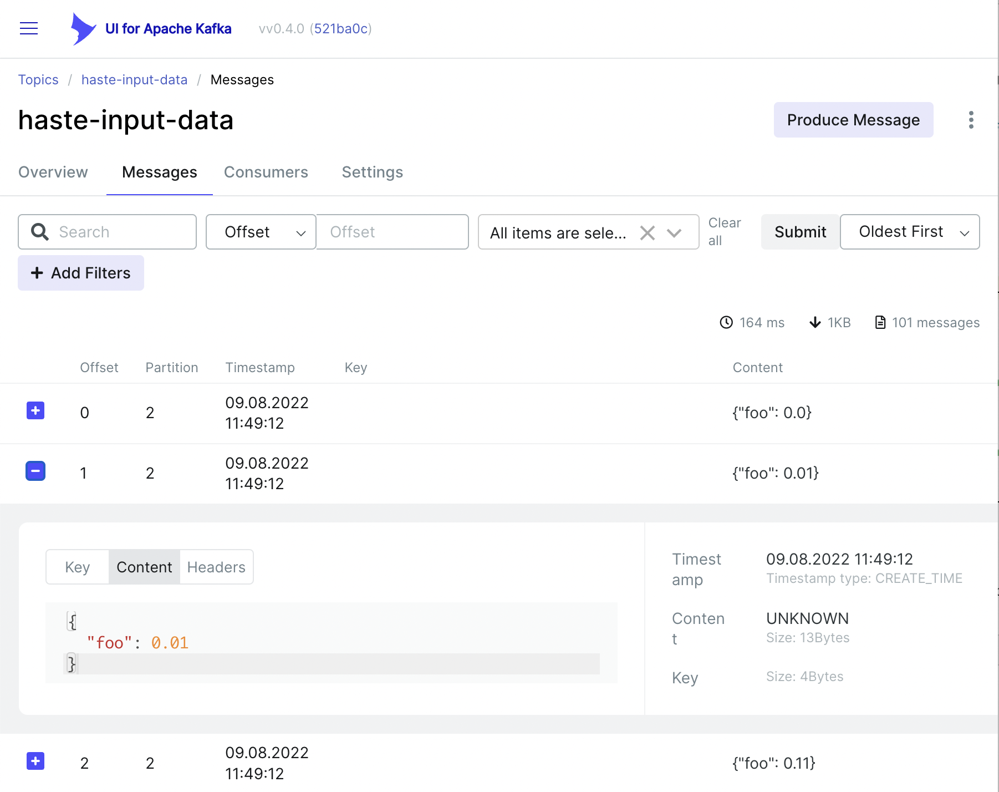
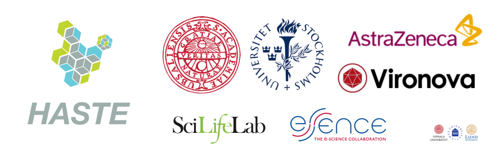

# HASTE-o-MATIC

Tiered, streamed, data management tool. 
See the demo: [https://www.dropbox.com/s/lz5l35g7q9l6lli/haste-o-matic-demo-dec.mov?dl=0]()

## DEPLOYMENT INSTRUCTIONS FOR UBUNTU (22.04)

0. Connect to a fresh VM, forwarding ports to these ports on the server:
  localhost:8001 (for the microK8s dashboard)
  localhost:8080 (for the HOM HTTP services.)
See: [https://www.ibm.com/support/pages/what-are-ssh-tunnels-and-how-use-them]()

For example:
```
ssh ubuntu@<host> -i <key-file> -L 8080:localhost:80 -L 8001:localhost:8001
```

1. Installation steps (tested on Ubuntu 22.04): 
```
sudo apt update -y ; sudo apt upgrade -y

# See: https://microk8s.io/docs/getting-started
# This creates the microk8s group.
sudo snap install microk8s --classic --channel=1.24/stable

# Join the group (it must exist).
sudo usermod -a -G microk8s $USER ; sudo chown -f -R $USER ~/.kube
# We can't use su on ubuntu as per the instructions, so we use newgrp to start a new shell logged into the group: 
newgrp microk8s
groups

# Run the remaining install script via curl:
source <(curl -s https://raw.githubusercontent.com/HASTE-project/hom-2/main/ubuntu-curl-install.sh)

# Start the proxy to the dashboard in the background (also run this if you restart the VM:
microk8s kubectl proxy &
```

The token used to access the dashboard is printed in the console, it will look something like this:

```
--- BEGIN DASHBOARD TOKEN ---
eyJhbGciOiJSUzI1NiIsImtpZCI6IjFCdTBGNXlCV3V2djZyb0xvRWtUU193WnBxZGVZcjRaOWVhcFpJbkFsMk
EifQeyJpc3MiOiJrdWJlcm5ldGVzL3NlcnZpY2VhY2NvdW50Iiwia3ViZXJuZRlcy5pby9zZXJ2aWNlYWNjb3V
udC9uYW1lc3BhY2UiOiJrdWJlLXN5c3RlbSIsImt1YmVybmV0ZXtH_CDT9TuTq3QntWw8_KbrbuUx6Qwteb8qL
1wj7do9kGz1HH-EKBPt39OpmyEFJtYLeLANF6s0xngJgU3Th8aly0DaLTh674brY5jciKqkiulSMFtK3SxUYux
aRPM-tgpFtHYAtgT8rk4q3dPbTRtJM5MPnsyaog96m6jTe8FX-e19Ad-OkVoJgdOWzN73iV9VI0WbrtYw
--- END DASHBOARD TOKEN ---
```

2. Assuming port forwarding is setup correctly, you can now access (don't forget the trailing slash):

[The Dashboard](http://localhost:8001/api/v1/namespaces/kubernetes-dashboard/services/https:kubernetes-dashboard:/proxy/#/workloads?namespace=hom)

[http://localhost:8080/gui/](http://localhost:8080/gui/) (the GUI)

[http://localhost:8080/notebook/](http://localhost:8080/notebook/) (Jupyter) 
The password is `hej-hom-impl-foo` (Note that access to all the web services, including the notebook, is protected by the SSH login)

[http://localhost:8080/kafka-gui/](http://localhost:8080/kafka-gui/) (Kafka-ui) 

3. (re)Start the demo application can restart/begin streaming data:
```
sudo microk8s kubectl delete pod demo-data ; sudo microk8s kubectl run demo-data --image benblamey/hom-impl-2.jexl-stream-worker --attach='true' --stdin --command --image-pull-policy='Always' --restart=Always -- java -cp output.jar -Droot.log.level=DEBUG -Dcom.benblamey.hom.demodata.DemoDataProducer.log.level=DEBUG -Dorg.slf4j.simpleLogger.defaultLogLevel=debug -DKAFKA_BOOTSTRAP_SERVER=kafka-service:9092 com.benblamey.hom.demodata.DemoDataMain
```

4. Go into [the GUI](http://localhost:8080/gui/) and add an input tier for `haste-input-data`.

5. Go into Jupyter and run tier-0 notebook to analyze the sample tier, following the video tutorial.


## Screenshots:

Kafka UI: 



## Known Issues:

An MTU mismatch in Kubernetes can cause issues with using TLS/SSL, for example with pip package installation ('Read timed out').

Check the MTUs like this:
´´´
ip a | grep mtu
´´´

They can be set like this (see: https://projectcalico.docs.tigera.io/networking/mtu):
´´´
microk8s kubectl patch configmap/calico-config -n kube-system --type merge  -p '{"data":{"veth_mtu": "1450"}}'
microk8s kubectl rollout restart daemonset calico-node -n kube-system
´´´

Then the pods/deployments need to be re-created.


## Contributors 
* Ben Blamey [http://www.benblamey.com](http://www.benblamey.com)
* Bipin Patel [https://github.com/BipinPatel](https://github.com/BipinPatel)
* Haoyuan Li [https://github.com/Haoyuan-L](https://github.com/Haoyuan-L)


The HASTE-o-matic tool is part of the HASTE project. [http://haste.research.it.uu.se/]()

